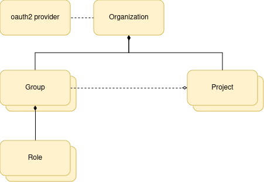
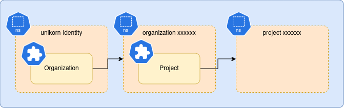

# Unikorn Identity


Unikorn's Identity Provider.
This package provides an OIDC compliant server, that federates other OIDC compliant backends.

Users are designed to be ephemeral, thus requiring no state management, no databases and result in a component that can be horizontally scaled trivially.

## Architecture



Conceptually, the identity service is quite simple, but does feature some enterprise grade features, described in the following sections.

### Organizations

The top level resource type is an organization.
Organizations are indexed via name, the name must be unique across the system, and is limited by normal Kubernetes resource name semantics (i.e. a DNS label).

Organizations MAY define a domain e.g. `acme.com`.
This allows users to login via email address where one of the generic IdP backends does not suffice, or the user isn't aware of who is providing identity services.
By specifying a domain, any user whose email domain matches a registered organization domain will be routed to the correct IdP configured for the organization.
This allows the use of a custom IdP that is not Google Identity (Google Workspace) or Microsoft Entra (Office 365), for example Okta or Authentik.

### oauth2 Providers

The identity service provides some generic providers, Google, and Microsoft, which covers the vast majority of many organizations.

You can _bring your own_ by providing:

* And OIDC compliant issuer endpoint
* A client ID
* A client secret

Providers may have a supported driver build into the identity service that allows groups to be read from the identity provider for use in group mapping.

### Groups

Every organization SHOULD have some groups, as it's useless without them.
Groups define a set of users that belong to them, and a set of roles associated with that group.

Users can be included explicitly, implicitly, or a mixture of both.
Explicit users are simply added to a list within the group, the user name MUST be the user's canonical name (as returned by the _id\_token_ after authentication), and not an alias.
Implicit users are defined by an identity provider group, and are generally easier to govern for large organization.

There are no constraints on which users can belong to any group, thus enabling - for example - an external contractor to be added, or a user to be a member of multiple organizations.

When a user is part of an organization group, it can discover that organization.
Any user is not part of an organization will be denied entry to the system, and require either adding to a new organization via a back-channel (e.g. customer onboarding), or adding by an organization admin.

### Roles

Every group SHOULD have at last one role.

We define a number of default roles, but the system is flexible enough to have any arbitrary roles.

The `admin` role allows broad access across the organization, it can edit organizations, create roles and associate users with them, and create projects and associate groups with them.
Admin users can generally see all resources within the organization defined for other services, and manage them.

The `user` role cannot modify anything defined by the identity service, it's only allowed to discover organizations and projects its a member of.
Users SHOULD have additional permissions defined for external services, e.g. provisioning and management of compute infrastructure.

The `reader` is similar to the `user` but allows read only access, typically used by billing and auditing teams.

### Projects

Projects provide workspaces for use by external services.
Projects are visible to all `admin` users.
Other users are included in a project by associating it with a group, therefore each project SHOULD have at least one group associated with it.

Like most other components, flexibility is built in by design, so a project can be shared with multiple groups.

## Security

### OIDC Clients

Any compliant OIDC client library should be able to interact with the identity service.
It features service discovery for simple configuration, and the login hint extension for seamless token refresh.

To enable a client, you will need to create a `oauth2client` resource in the identity service namespace, featuring the client ID (must be unique, typically you can use `uuidgen` for this), and an OIDC callback URI.

Optionally you can override the branding with a custom login URL callback too.
See the [reference implementation](pkg/oauth2/login.tmpl) for the interface.

### RBAC

The identity service provides centralized role based access control to the unikorn suite of services.
As described previously, roles can be arbitrary and apply to services outside of the identity service.

A role is composed of a set of arbitrary scopes, that typically define an API end point group e.g. clusters or projects.
Within a scope is a set of permissions; create, read, update and delete (i.e. CRUD).

As everything should be scoped to an organization, with the exception of organization discovery etc, you can poll an API on the organization requesting an access control list (ACL).
An ACL is a list of all projects that the user if a member of within that organization, and each project contains a union of all the scopes and CRUD permissions granted within that project.

The ACL can be used to:

* Control API access to endpoint resources.
* Drive UI views tailored to what actions the user can actually perform.

There is a special shortcut for a "super admin" user, who as a platform administrator can see and do anything.

### Scoping

Further to basic RBAC and ACLs, a second API details what the user can see.

For example, you may want to view all resource of one type within the organization as an overview.
You need to only be returned resources that belong to projects you have read access to.

Typically this information is used to construct label selectors for Unikorn services.

This functionality piggy-backs on the `userinfo` OIDC API, but don't rely on that, instead a shared library provided by Unikorn Core should be used to provide this functionality in your services.

## Integration with Other Services

By itself, the identity service doesn't offer much functionality beyond simple OIDC authentication flows.
Other services are responsible for provisioning and managing actual resources.

Because this is a multi-tenant system, we need a top level organization to be unique, this is achieved by having these all provisioned in the identity service's namespace.
We do anticipate most users to expect they can provision any cluster name they wish, so these must be provisioned in an organization specific namespace.
Likewise, multiple projects within the same organization may want resources that are named the same in different projects, for example to facilitate different environments, so these need a project specific namespace too.



The identity service manages all this for you automatically.
Unique namespace names are automatically generated by the platform, and organization and project resources record this in their status for easy navigation.

Other services, e.g. the core Kubernetes service can then consume the project namespace by having their custom resources residing in there, separating them from other projects and other organizations.

## Installation

Identity is the first thing you should install, as it provides authentication services for other services, or can be used as a standalone identity provider.

### Prerequisites

* A domain name (`acme.com` for this tutorial)
* [external-dns](https://github.com/kubernetes-sigs/external-dns) configured on your Kubernetes cluster to listen to `Ingress` resources.
* [cert-manager](https://cert-manager.io/) configured on your Kubernetes cluster
* A cert-manager `ClusterIssuer` configured for use, typically Let's Encrypt, but you can use a self signed CA.

```shell
DOMAIN=acme.com
```

### Configuring an OIDC Backend

First you will need to calculate what the OIDC callback will be.
Choose a public DNS name from your domain e.g. `identity.acme.com`.
The OIDC callback URI will be `https://identity.acme.com/oidc/callback`:

```shell
IDENTITY_HOST=identity.${DOMAIN}
IDENTITY_OIDC_CALLBACK=https://${IDENTITY_HOST}/oidc/callback
```

Most OIDC providers will be configured by creating an "Application".
This will require the callback URI to be registered as trusted.
The identity provider will give you an issuer or discovery endpoint, client ID and client secret for the following steps.

**NOTE**: Only Google Identity and Microsoft Entra are currently supported.

**NOTE**: Google Identity will need the Directory Service API enabling in the Cloud Console for RBAC integration.

**NOTE**: Documentation for individual providers is provided by them.

### Installing the Service with Helm

You must first define where the UI will live in order to configure that OIDC callback and setup CORS:

```shell
UI_HOST=console.${DOMAIN}
UI_ORIGIN=https://${UI_HOST}
UI_OIDC_CALLBACK=${UI_ORIGIN}/oauth2/callback
UI_LOGIN_CALLBACK=${UI_ORIGIN}/login
UI_CLIENT_ID=$(uuidgen)
```

Create a basic `values.yaml` file:

```yaml
host: ${IDENTITY_HOST}
cors:
  allowOrigin:
  - ${UI_ORIGIN}
ingress:
  clusterIssuer: letsencrypt-production
  externalDns: true
clients:
- name: unikorn-ui
  id: ${UI_CLIENT_ID}
  redirectURI: ${UI_OIDC_CALLBACK}
  loginURI: ${UI_LOGIN_CALLBACK} # (optional)
providers:
# Use "uuidgen -r" to select a random ID, this MUST start with a character a-f.
- id: bec71681-8749-4816-a708-7f529d20db2e
  type: google # (must be either google or microsoft)
  name: google-identity
  displayName: Google Identity
  issuer: https://accounts.google.com
  clientID: <string> # provided by the identity provider, see above
  clientSecret: <string> # provider by the identity provider, see above
```

Install the Helm repository:

```shell
helm repo add unikorn-identity https://unikorn-cloud.github.io/identity
```

Deploy:

```shell
helm update --install --namespace unikorn-identity unikorn-identity/unikorn-identity -f values.yaml
```

### Creating an Organization

Organizations allow users to actually log in.
A user must be mapped to an organization to be permitted access.
Organizations are typically manged via a back channel after email verification, billing and other tests.

Create an organization resource:

```yaml
apiVersion: identity.unikorn-cloud.org/v1alpha1
kind: Organization
metadata:
  # Use "uuidgen -r" to select a random ID, this MUST start with a character a-f.
  name: bec71681-8749-4816-a708-7f529d20db2e
  namespace: unikorn-identity
  labels:
    # This is the human readable, and mutable, name that will get displayed in clients.
    # It is expected to exist on all CRD backed resources.
    resource.unikorn-cloud.org/name: acme.com
```

This will provision fairly quickly, you can extract the organization's namespace via:

```
$ kubectl get organizations.identity.unikorn-cloud.org -A
NAMESPACE          NAME                                   DISPLAY NAME   NAMESPACE            STATUS        AGE
unikorn-identity   bec71681-8749-4816-a708-7f529d20db2e   acme.com       organization-kmvxk   Provisioned   17s
```

Next create a group in that organization associated with a user:

```yaml
apiVersion: identity.unikorn-cloud.org/v1alpha1
kind: Group
metadata:
  # Use "uuidgen -r" to select a random ID, this MUST start with a character a-f.
  name: c7e8492f-c320-4278-8201-48cd38fed38b
  namespace: organization-kmvxk
  labels:
    # This is the human readable, and mutable, name that will get displayed in clients.
    # It is expected to exist on all CRD backed resources.
    resource.unikorn-cloud.org/name: super-admins
  annotations:
    # This is a verbose description that can be added to resources.
    resource.unikorn-cloud.org/description: Platform administrators.
spec:
  roles:
  - superAdmin
  users:
  - user@gmail.com
```

### What Next?

As you've noted, objects are named based on UUIDs, therefore administration is somewhat counterintuitive, but it does allow names to be mutable.
For ease of management we recommend installing the [UI](https://github.com/unikorn-cloud/ui)
